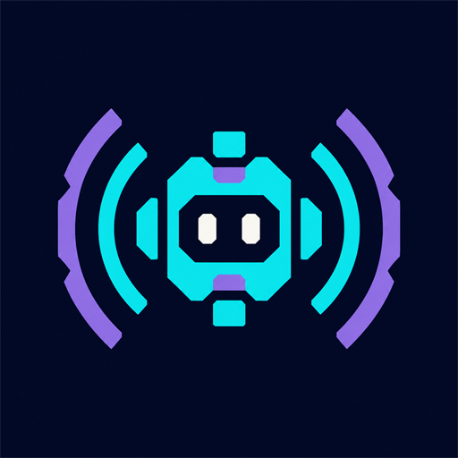

# Echo Companion

<p align="center">
  
</p>

## Introduction / 项目介绍

### English

Echo Companion is an original client-side AI dialogue companion mod for Minecraft Java Edition 1.21.1, built for both Fabric and NeoForge. It provides an in-game dialogue screen, HUD status indicators, AI settings, and two switchable modes:

- `SCRIPTED`: fully offline, rule-based “pseudo-AI” dialogue that requires no API key.
- `REMOTE`: replies generated through a player-configured OpenAI-compatible Chat Completions endpoint, with an optional fallback to `SCRIPTED` if the remote service fails.

The mod's gameplay is inspired by Verity. Echo Companion is an independent, original implementation and does not copy, bundle, or redistribute any code, assets, dialogue, branding, or other content from Verity or ARR.

The current implementation is a client-side dialogue companion, not a pathfinding NPC. It cannot execute commands, take control of the player, or modify the server world.

### 中文

Echo Companion 是一个面向 Minecraft Java Edition 1.21.1 的原创客户端 AI 对话伴侣模组，同时提供 Fabric 与 NeoForge 版本。它包含游戏内对话界面、HUD 状态提示、AI 设置，以及两种可切换模式：

- `SCRIPTED`：完全离线、基于规则的“伪 AI”对话，无需 API Key。
- `REMOTE`：通过玩家自行配置的 OpenAI-compatible Chat Completions 接口生成回复；远程服务失败时，可选择回退到 `SCRIPTED`。

模组玩法受 Verity 启发。Echo Companion 是独立、原创实现，不复制、打包或再分发 Verity 或 ARR 的代码、资产、对话、品牌标识或其他内容。

当前实现是客户端对话伴侣，并非可寻路的 NPC。它不能执行指令、接管玩家操作或修改服务器世界。

## Supported Scope / 支持范围

### English

| Item | Current scope |
| --- | --- |
| Minecraft | 1.21.1 |
| Java | 21 or later |
| Fabric | Fabric Loader 0.16.0 or later; build baseline: 0.16.14 |
| NeoForge | NeoForge 21.1; build baseline: 21.1.216 |
| Environment | Client-side |
| Mod version | 0.1.0 (early development) |

“Multi-loader support” currently means support for both Fabric and NeoForge. The project does not claim compatibility with other Minecraft versions.

### 中文

| 项目 | 当前范围 |
| --- | --- |
| Minecraft | 1.21.1 |
| Java | 21 或更高版本 |
| Fabric | Fabric Loader 0.16.0 或更高版本；构建基线为 0.16.14 |
| NeoForge | NeoForge 21.1；构建基线为 21.1.216 |
| 运行位置 | 客户端 |
| 模组版本 | 0.1.0（早期开发） |

这里的“多加载器支持”是指同时支持 Fabric 与 NeoForge。当前项目不宣称兼容其他 Minecraft 版本。

## Usage / 使用方法

### English

1. Install the Fabric or NeoForge loader that matches your game instance.
2. Place the corresponding Echo Companion JAR in the client instance's `mods` directory. Do not install both loader variants at the same time.
3. Open `Options` from the main menu or in-game menu, then select `Echo AI Settings` in the upper-right corner.
4. Select `SCRIPTED` or `REMOTE`, enter the endpoint, model, and API key as needed, then save the settings.
5. Enter a world, open the pause menu, and select `Chat with Echo`. The AI settings can also be reopened from the dialogue screen.

In `REMOTE` mode, you can enable fallback to the pseudo-AI engine. If the remote service is unavailable or returns an invalid response, Echo Companion displays an offline rule-based reply and marks it as a fallback result.

### 中文

1. 安装与游戏实例相匹配的 Fabric 或 NeoForge 加载器。
2. 将对应加载器的 Echo Companion JAR 放入客户端实例的 `mods` 目录。请勿同时安装两个加载器版本。
3. 从主菜单或游戏内菜单打开“选项”，然后点击右上角的“Echo AI 设置”。
4. 选择 `SCRIPTED` 或 `REMOTE`，按需填写接口、模型和 API Key，然后保存设置。
5. 进入世界后打开暂停菜单，点击“与 Echo 对话”。也可以从对话界面再次进入 AI 设置。

在 `REMOTE` 模式下，可以启用“失败回退伪 AI”。远程服务不可用或返回无效响应时，Echo Companion 会显示离线规则回复，并将其标记为回退结果。

## OpenAI-Compatible Endpoint / OpenAI-compatible 接口

### English

Enter a complete Chat Completions endpoint in the settings, for example:

```text
https://api.openai.com/v1/chat/completions
```

The service must accept non-streaming `POST` requests. The request body contains `model` and `messages`. When the API key is not empty, it is sent through the `Authorization: Bearer <key>` header. The response must contain a string value at `choices[0].message.content`.

The current version does not support the OpenAI Responses API, streaming SSE, tool calls, or provider-specific request structures. Endpoint compatibility, service availability, and billing are determined by the selected service provider.

For security, public endpoints must use HTTPS. HTTP is allowed only for `localhost`, `127.0.0.1`, and IPv6 loopback addresses. Endpoints containing user information, query parameters, or fragments are rejected. Never place an API key in the URL. The client also does not follow HTTP redirects.

### 中文

请在设置中填写完整的 Chat Completions endpoint，例如：

```text
https://api.openai.com/v1/chat/completions
```

服务端必须接受非流式 `POST` 请求。请求体包含 `model` 与 `messages`；API Key 非空时，会通过 `Authorization: Bearer <key>` 请求头发送。响应必须在 `choices[0].message.content` 中包含字符串值。

当前版本不支持 OpenAI Responses API、流式 SSE、工具调用或服务提供商专有的请求结构。接口是否兼容、服务是否可用以及如何计费，均由所选服务提供商决定。

出于安全考虑，公网 endpoint 必须使用 HTTPS。只有 `localhost`、`127.0.0.1` 和 IPv6 回环地址可以使用 HTTP。endpoint 不允许包含用户信息、查询参数或片段。请勿将 API Key 放入 URL；客户端也不会跟随 HTTP 重定向。

## API Key and Privacy / API Key 与隐私

### English

- API keys are not remembered by default. After the settings are saved, the key remains available only to the current game process and is not written to the configuration file. It must be entered again after restarting the game.
- If `Remember Key on This Device` is explicitly enabled, the key is stored as unencrypted plaintext in `config/echo_companion-client.json` inside the current game instance. Any software, mod, user, or account able to read that file or the client process may obtain the key.
- The API key is not sent to the game server through Minecraft network packets, but it is sent as authentication information to the player-configured remote endpoint. Use only services that you trust.
- `REMOTE` sends the system prompt and messages from the current local conversation to the configured endpoint. The `SCRIPTED` engine does not make remote AI requests.
- Conversation history is held only by the client session. The current implementation has no server command channel and does not use model replies to control the server world.

Use a dedicated, revocable API key with a limited spending quota. Never place a real key in source code, commits, issues, logs, or screenshots. See the [Security Policy](SECURITY.md) for more information.

### 中文

- 默认不记住 API Key。保存设置后，Key 仅供当前游戏进程使用，不会写入配置文件；重新启动游戏后需要再次输入。
- 如果主动开启“在本机记住 Key”，Key 会以未加密明文写入当前游戏实例的 `config/echo_companion-client.json`。任何能够读取该文件或客户端进程的软件、模组、用户或账户，都可能取得该 Key。
- API Key 不会通过 Minecraft 网络包发送给游戏服务器，但会作为认证信息发送至玩家配置的远程 endpoint。请仅使用自己信任的服务。
- `REMOTE` 会将系统提示和本次本地对话中的消息发送至所配置的 endpoint；`SCRIPTED` 引擎不会发起远程 AI 请求。
- 对话历史仅由客户端会话持有。当前实现没有服务器指令通道，也不会根据模型回复控制服务器世界。

建议使用可撤销、有限额度的专用 API Key。请勿将真实 Key 写入源码、提交、Issue、日志或截图。更多信息请参阅[安全策略](SECURITY.md)。

## Building and Testing from Source / 从源码构建与测试

### English

JDK 21 is required. The repository includes the Gradle Wrapper, so a separate Gradle installation is not needed.

Windows PowerShell:

```powershell
.\gradlew.bat clean test build
```

Linux / macOS:

```bash
./gradlew clean test build
```

You can also run each task separately:

```powershell
.\gradlew.bat :common:test
.\gradlew.bat :fabric:build
.\gradlew.bat :neoforge:build
```

Build artifacts are written to `fabric/build/libs/` and `neoforge/build/libs/`. For releases, use the remapped JARs whose filenames do not include the `-sources` or `-dev-shadow` suffix.

In some Windows environments, launching a Gradle test worker directly from an absolute path containing Chinese characters may incorrectly report `ClassNotFoundException` for test classes that were compiled successfully. If this specific failure occurs, rerun the tests from a pure-ASCII path or through a temporary ASCII drive mapping. Do not ignore the failure or treat it as a passing result. See the safe temporary-drive example in the [release guide](docs/RELEASING.md#windows-中文路径说明).

The GitHub Actions workflow first runs the shared-module unit tests and then builds the Fabric and NeoForge versions separately. The presence of a workflow does not constitute completed validation. Before release, manual startup and interface checks must still be performed in isolated client instances for both loaders. See the complete checklist in the [release guide](docs/RELEASING.md).

### 中文

需要 JDK 21。仓库自带 Gradle Wrapper，无需另行安装 Gradle。

Windows PowerShell：

```powershell
.\gradlew.bat clean test build
```

Linux / macOS：

```bash
./gradlew clean test build
```

也可以分别执行各项任务：

```powershell
.\gradlew.bat :common:test
.\gradlew.bat :fabric:build
.\gradlew.bat :neoforge:build
```

构建产物位于 `fabric/build/libs/` 与 `neoforge/build/libs/`。发布时应选择文件名中不带 `-sources` 或 `-dev-shadow` 后缀的重映射 JAR。

在部分 Windows 环境中，如果直接从含中文字符的绝对路径启动 Gradle test worker，可能会错误地对已成功编译的测试类报告 `ClassNotFoundException`。遇到这一特定问题时，应从纯 ASCII 路径或通过临时 ASCII 盘符重新执行测试；不能忽略该失败，也不能将其视为测试通过。安全的临时盘符示例见[发布说明](docs/RELEASING.md#windows-中文路径说明)。

仓库中的 GitHub Actions 工作流会先运行共享模块的单元测试，再分别构建 Fabric 与 NeoForge 版本。存在工作流并不等同于已经完成验证。发布前仍须在两个加载器各自隔离的客户端实例中进行手动启动和界面检查。完整清单见[发布说明](docs/RELEASING.md)。

## Project Structure / 项目结构

### English

```text
common/    Shared dialogue, configuration, interface, and test code
fabric/    Fabric entry point and packaging configuration
neoforge/  NeoForge entry point and packaging configuration
docs/      Architecture boundaries and release process
```

See the [architecture documentation](docs/ARCHITECTURE.md) for details about the design and security boundaries.

### 中文

```text
common/    共享的对话、配置、界面与测试代码
fabric/    Fabric 入口与打包配置
neoforge/  NeoForge 入口与打包配置
docs/      架构边界与发布流程
```

有关设计与安全边界的详细说明，请参阅[架构说明](docs/ARCHITECTURE.md)。

## Relationship with Verity and ARR / 与 Verity 和 ARR 的关系

### English

The mod's gameplay is inspired by Verity. Echo Companion is an independent, original implementation and is not affiliated with, endorsed by, or authorized by the authors or projects behind Verity or ARR. This repository does not copy, bundle, or redistribute any code, names, dialogue text, models, textures, sounds, UI, branding, or other assets from Verity or ARR.

Contributions must maintain the same boundary. Do not submit copyrighted content extracted from Verity, ARR, or any other third-party project. All third-party dependencies and materials must have clear and compatible licenses.

### 中文

模组玩法受 Verity 启发。Echo Companion 是独立、原创的实现，与 Verity 或 ARR 的作者及项目不存在从属、认可或授权关系。本仓库不复制、打包或再分发 Verity 或 ARR 的任何代码、名称、对话文本、模型、纹理、声音、UI、品牌标识或其他资产。

贡献内容也必须遵守同样的边界。请勿提交从 Verity、ARR 或其他第三方项目中提取的受版权保护内容；所有第三方依赖和素材都必须具有明确且兼容的许可证。

## Contributing / 参与贡献

### English

Before submitting an Issue or Pull Request, please read the [contribution guide](.github/CONTRIBUTING.md). Make sure that API keys, `Authorization` request headers, and other private information are removed from bug reports.

### 中文

提交 Issue 或 Pull Request 前，请阅读[贡献指南](.github/CONTRIBUTING.md)。提交 Bug 报告时，务必删除 API Key、`Authorization` 请求头及其他私人信息。

## License / 许可证

### English

This project is open-sourced under the [MIT License](LICENSE). The license covers only original content contributed to this repository and does not grant any rights to third-party games, mods, brands, or materials.

### 中文

本项目以 [MIT License](LICENSE) 开源。该许可证仅覆盖本仓库中由项目贡献者提供的原创内容，不授予任何第三方游戏、模组、品牌或素材的权利。
